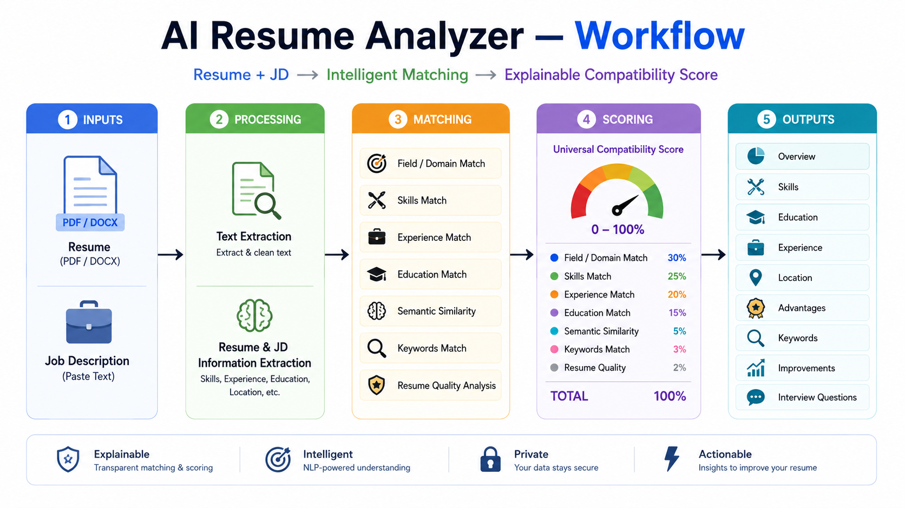

# AI Resume Analyzer

## Description

AI Resume Analyzer is a **Streamlit-based CV and Job Description matching system** built with Python and NLP.

It analyzes a candidate's PDF/DOCX resume against a Job Description and provides:

* Field / Domain Match
* Skill Match
* Experience Match
* Education Match
* Semantic Similarity
* Keyword Analysis
* Resume Quality
* Location Status
* Additional Advantages
* Resume Improvements
* Interview Questions
* Overall Compatibility Score

## Workflow



## Project Structure

```text
ai-resume-analyzer/
│
├── app.py
├── config.py
│
├── core/
│   ├── ats.py
│   ├── experience.py
│   ├── file_parser.py
│   ├── generation.py
│   ├── keyword_analyzer.py
│   ├── pipeline.py
│   ├── requirements_matcher.py
│   ├── semantic.py
│   ├── skills.py
│   └── text_utils.py
│
├── ui/
│   └── analyze_page.py
│
├── assets/
│   └── ai_resume_analyzer_workflow.png
│
├── tests/
├── requirements.txt
├── pytest.ini
├── .gitignore
└── README.md
```

## Main Technologies Used

* **Python** — Core application logic
* **Streamlit** — User interface
* **PyMuPDF** — PDF text extraction
* **python-docx** — DOCX text extraction
* **Sentence Transformers** — Semantic CV ↔ JD similarity
* **all-MiniLM-L6-v2** — Sentence embedding model
* **scikit-learn** — Keyword and similarity analysis
* **NumPy** — Numerical operations
* **Regex** — Requirement, date, and experience extraction

## Live Link

```text
https://ai-resume-analyzer-th.streamlit.app/
```

## How to Run

### 1. Clone the Repository

```bash
git clone https://github.com/tofayel-hossain/ai-resume-analyzer.git
cd ai-resume-analyzer
```

### 2. Create Virtual Environment

#### Windows

```powershell
python -m venv .venv
```

#### macOS / Linux

```bash
python3 -m venv .venv
source .venv/bin/activate
```

### 3. Install Dependencies

```bash
pip install -r requirements.txt
```

### 4. Run the Application

```bash
python -m streamlit run app.py
```

Open:

```text
http://localhost:8501
```

## How to Use

1. Upload your resume in **PDF or DOCX** format.
2. Paste the complete **Job Description**.
3. Click **Analyze Resume**.
4. View your compatibility score and detailed analysis.
5. Check Skills, Education, Experience, Location, Advantages, Improvements, and Interview Questions.

## Author

**Tofayel Hossain**